# E-Commerce Clickstream Analysis
### SQL · SQLite · DBeaver · Python · Tableau

---

## Business Problem

An e-commerce retailer has a fundamental question it cannot answer from its sales reports alone: **why are so many customers browsing but not buying?**

Revenue numbers tell you *how much* was sold. Clickstream data tells you *why* customers didn't buy — where they dropped off, what they viewed, what they added to cart and then abandoned, and what the highest-value lost opportunities look like.

This analysis uses **October 2019 clickstream data** to diagnose the conversion problem, identify which categories, brands, and products are underperforming relative to their traffic, and surface actionable recommendations for the business.

**Key questions this project answers:**
- Where exactly in the funnel are customers dropping off?
- Which product categories drive traffic but fail to convert?
- Which brands are losing the most revenue to cart abandonment?
- Is price a barrier to conversion, or does something else explain the drop-off?
- Who are the customers — are they returning, or mostly one-time visitors?

---

## Dataset & Tools

| | |
|---|---|
| **Dataset** | [E-Commerce - Multi Category Store — October 2019](https://www.kaggle.com/datasets/mkechinov/ecommerce-behavior-data-from-multi-category-store?select=2019-Oct.csv) |
| **Sample Size** | 20,000 rows x 9 columns |
| **Event Types** | View, Cart, Purchase |
| **Fields** | event_time, event_type, product_id, category_id, category_code, brand, price, user_id, user_session |
| **Database** | SQLite via DBeaver |
| **Automation** | Python (CSV exports for Tableau) |
| **Visualisation** | Tableau Public |

---

## Table of Contents

1. [Data Cleaning](#1-data-cleaning)
2. [Funnel Analysis](#2-funnel-analysis)
3. [Trend Analysis](#3-trend-analysis)
4. [Category & Sub-Category Performance](#4-category--sub-category-performance)
5. [Revenue Analysis](#5-revenue-analysis)
6. [Brand Analysis](#6-brand-analysis)
7. [User Behaviour Analysis](#7-user-behaviour-analysis)
8. [Cart Abandonment Analysis](#8-cart-abandonment-analysis)
9. [Product-Level Analysis](#9-product-level-analysis)
10. [Python Automation](#10-python-automation)
11. [Key Findings & Recommendations](#10-key-findings--recommendations)

---

## 1. Data Cleaning

Before any analysis could begin, the raw data needed significant work. The dataset contained inconsistent casing, missing values, and no derived fields to support time-based or hierarchical analysis.

### Sampling & Deduplication

The full dataset was large, so I first checked and removed duplicate records — rows where every field was identical, indicating double-logged events.

```sql

-- Identify and Remove duplicates
select *
from(
select *,row_number() over (partition by event_time,event_type,product_id,category_id,category_code,brand,price,user_id,user_session) as row_num
from customer_data
) row_numbers
where row_num>1;

create table customer_data1(
event_time timestamp,
event_type varchar(100),
product_id integer,
category_id integer,
category_code varchar(100),
brand varchar(100),
price numeric(10,2),
user_id integer,
user_session varchar(100)
);

alter table customer_data1 add column row_num integer;

insert into customer_data1 
select *
from(
select *,row_number() over (partition by event_time,event_type,product_id,category_id,category_code,brand,price,user_id,user_session) as row_num
from customer_data
) 
where row_num=1;

select *
from customer_data1
limit 10;
```

### Standardising Text Fields

Event types and brand names had inconsistent capitalisation (`'purchase'`, `'Purchase'`). I standardised all text fields to title case.

```sql
-- Standardise event_type casing
UPDATE customer_data1
SET event_type = UPPER(SUBSTR(event_type, 1, 1)) 
             || LOWER(SUBSTR(event_type, 2, LENGTH(event_type)));

-- Standardise brand casing
UPDATE customer_data1
SET brand = UPPER(SUBSTR(brand, 1, 1)) 
         || LOWER(SUBSTR(brand, 2, LENGTH(brand)));
```

### Parsing Hierarchical Category Codes

The `category_code` field contained dot-separated hierarchies like `electronics.smartphone` or `appliances.kitchen.coffee_machine`. I split this into three separate columns(Category, Sub-Category and Product) for cleaner analysis.

```sql
-- Title-case category_code with 1 or 2 dots (e.g. "Electronics.Smartphone")
UPDATE customer_data1
SET category_code = CASE
    WHEN LENGTH(category_code) - LENGTH(REPLACE(category_code, '.', '')) = 2
    THEN UPPER(SUBSTR(category_code,1,1)) 
         || LOWER(SUBSTR(category_code,2,INSTR(category_code,'.')-2)) || '.'
         || UPPER(SUBSTR(category_code,INSTR(category_code,'.')+1,1))
         || LOWER(SUBSTR(category_code,INSTR(category_code,'.')+2,
            INSTR(SUBSTR(category_code,INSTR(category_code,'.')+1),'.')-2)) || '.'
         || UPPER(SUBSTR(category_code,INSTR(category_code,'.')+
            INSTR(SUBSTR(category_code,INSTR(category_code,'.')+1),'.')+1,1))
         || LOWER(SUBSTR(category_code,INSTR(category_code,'.')+
            INSTR(SUBSTR(category_code,INSTR(category_code,'.')+1),'.')+2))
    WHEN LENGTH(category_code) - LENGTH(REPLACE(category_code, '.', '')) = 1
    THEN UPPER(SUBSTR(category_code,1,1))
         || LOWER(SUBSTR(category_code,2,INSTR(category_code,'.')-2)) || '.'
         || UPPER(SUBSTR(category_code,INSTR(category_code,'.')+1,1))
         || LOWER(SUBSTR(category_code,INSTR(category_code,'.')+2))
    ELSE UPPER(SUBSTR(category_code,1,1)) || LOWER(SUBSTR(category_code,2))
END;

-- Extract category, sub_category, product into separate columns
ALTER TABLE customer_data1 ADD COLUMN category VARCHAR;
ALTER TABLE customer_data1 ADD COLUMN sub_category VARCHAR;
ALTER TABLE customer_data1 ADD COLUMN product VARCHAR;

UPDATE customer_data1
SET category = CASE
    WHEN INSTR(category_code, '.') > 0
    THEN SUBSTR(category_code, 1, INSTR(category_code, '.') - 1)
    ELSE category_code
END;

UPDATE customer_data1
SET sub_category=CASE
WHEN length(category_code)-length(replace(category_code,'.',''))=2
 THEN substr(category_code,instr(category_code,'.')+1,
       INSTR(substr(category_code,instr(category_code,'.')+1),'.')-1) 
WHEN length(category_code)-length(replace(category_code,'.',''))=1
 THEN substr(category_code,instr(category_code,'.')+1)
 ELSE NULL 
END;

UPDATE customer_data1
SET product=CASE
    WHEN length(category_code)-length(replace(category_code,'.',''))=2
       THEN substr(category_code,instr(category_code,'.')+
          INSTR(substr(category_code,instr(category_code,'.')+1),'.')+1)
   ELSE NULL 
END;

```

### Adding Time Columns, Handling Null and Removing Unecessary Columns

```sql
-- Extract date and calculate week beginning (Monday-anchored)
ALTER TABLE customer_data1 ADD COLUMN event_date DATE;
ALTER TABLE customer_data1 ADD COLUMN week_beginning DATE;

UPDATE customer_data1 SET event_date = SUBSTR(event_time, 1, 10);
UPDATE customer_data1 SET week_beginning = DATE(event_date, 'weekday 1', '-7 days');

---Checking ways to handle nulls in Product ID and Brand
SELECT DISTINCT t1.product_id, t1.category_code AS missing, t2.category_code AS available
FROM customer_data1 t1
JOIN customer_data1 t2 on t1.product_id = t2.product_id
WHERE (t1.category_code is null or TRIM(t1.category_code) = '')
AND (t2.category_code is not null and TRIM(t2.category_code) != '');

select distinct t1.brand, t1.product_id, t1.category_code AS missing, t2.category_code AS available
from customer_data1 t1
join customer_data1 t2 on t1.brand = t2.brand
and t1.product_id=t2.product_id
where (t1.category_code is null or TRIM(t1.category_code) = '')
and (t2.category_code is not null and TRIM(t2.category_code) != '');

-- Fill missing brands
UPDATE customer_data1
SET brand = 'Unbranded'
WHERE brand IS NULL OR TRIM(brand) = '';

-- Attempt to populate missing category_code from same product_id
-- (returned zero matching rows — those records were left as 'Uncategorized')
UPDATE customer_data1
SET category_code = 'Uncategorized'
WHERE category_code LIKE '';

--- Remove Unnecesary Columns
alter table customer_data1
drop column row_num;
```

> **Result:** Clean, structured table with consistent casing, parsed hierarchies, time dimensions, and no silent nulls — ready for analysis.

---

## 2. Funnel Analysis

The funnel is the most important view in this analysis. It answers the most basic question: of all the people who visited, how many actually bought something?

```sql
-- Session-level funnel (how many shopping trips converted)
SELECT
    COUNT(DISTINCT CASE WHEN event_type = 'View'     THEN user_session END) AS View_Sessions,
    COUNT(DISTINCT CASE WHEN event_type = 'Cart'     THEN user_session END) AS Cart_Sessions,
    COUNT(DISTINCT CASE WHEN event_type = 'Purchase' THEN user_session END) AS Purchase_Sessions
FROM customer_data1;

-- User-level funnel (how many individual customers converted)
SELECT
    COUNT(DISTINCT CASE WHEN event_type = 'View'     THEN user_id END) AS View_Users,
    COUNT(DISTINCT CASE WHEN event_type = 'Cart'     THEN user_id END) AS Cart_Users,
    COUNT(DISTINCT CASE WHEN event_type = 'Purchase' THEN user_id END) AS Purchase_Users
FROM customer_data1;

-- Conversion rates between each stage
WITH user_session_rates AS (
    SELECT
        COUNT(DISTINCT CASE WHEN event_type = 'View'     THEN user_session END) AS View_Sessions,
        COUNT(DISTINCT CASE WHEN event_type = 'Cart'     THEN user_session END) AS Cart_Sessions,
        COUNT(DISTINCT CASE WHEN event_type = 'Purchase' THEN user_session END) AS Purchase_Sessions
    FROM customer_data1
)
SELECT
    ROUND(Cart_Sessions     * 100.0 / View_Sessions,  2) AS View_to_Cart_Pct,
    ROUND(Purchase_Sessions * 100.0 / Cart_Sessions,  2) AS Cart_to_Purchase_Pct,
    ROUND(Purchase_Sessions * 100.0 / View_Sessions,  2) AS Overall_Conversion_Pct
FROM user_session_rates;
```

### Results

| Stage | Sessions | Users |
|-------|----------|-------|
| View | 19,171 | 18,859 |
| Cart | 438 | 438 |
| Purchase | 346 | 346 |

| Conversion Rate | % |
|---|---|
| View → Cart | **2.32%** |
| Cart → Purchase | **79.00%** |
| Overall (View → Purchase) | **1.83%** |

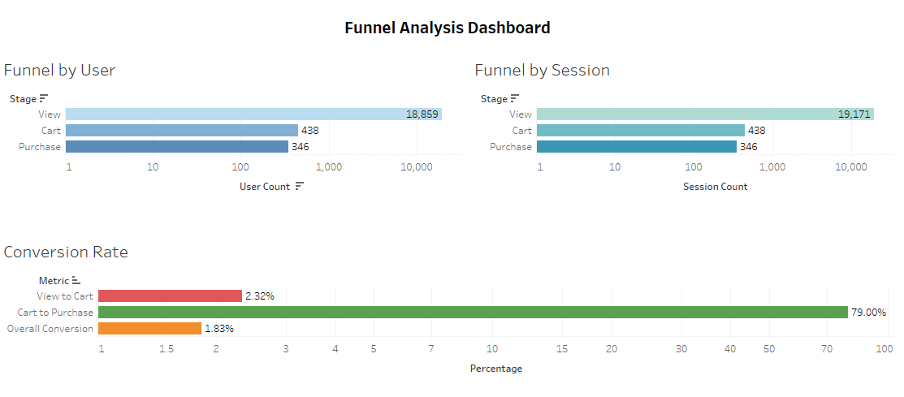

> **The critical finding: 97.7% of sessions that view a product never add anything to cart. But once a user does add to cart, 79% go on to purchase.** The business is not losing customers at checkout — it is losing them during browsing. The entire conversion problem sits at the View → Cart stage.

The 312-session gap between View sessions (19,171) and View users (18,859) tells us that at least 312 users came back to browse in a new session, suggesting some level of repeat intent — but still not converting to cart.

---

## 3. Trend Analysis

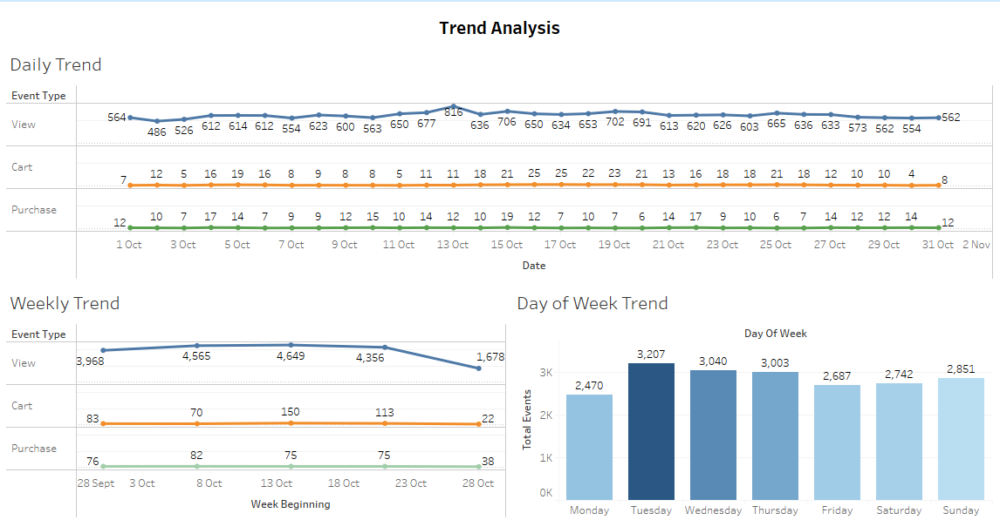

With the conversion problem identified, the next question is: does engagement vary over time, and are there patterns the business can act on?

```sql
-- Daily trend
SELECT
    event_date    AS Event_Date,
    event_type    AS Event_Type,
    COUNT(*)      AS Event_Count
FROM customer_data1
GROUP BY event_date, event_type
ORDER BY event_date;

-- Weekly trend with revenue
SELECT
    week_beginning AS Week_Beginning,
    event_type     AS Event_Type,
    COUNT(*)       AS Event_Count,
    ROUND(SUM(CASE WHEN event_type = 'Purchase' THEN price ELSE 0 END), 2) AS Weekly_Revenue
FROM customer_data1
GROUP BY week_beginning, event_type
ORDER BY week_beginning;

-- Day of week pattern
SELECT
    CASE STRFTIME('%w', event_date)
        WHEN '0' THEN 'Sunday'   WHEN '1' THEN 'Monday'
        WHEN '2' THEN 'Tuesday'  WHEN '3' THEN 'Wednesday'
        WHEN '4' THEN 'Thursday' WHEN '5' THEN 'Friday'
        WHEN '6' THEN 'Saturday'
    END AS Day_of_Week,
    COUNT(*) AS Total_Events
FROM customer_data1
GROUP BY STRFTIME('%w', event_date)
ORDER BY Total_Events DESC;
```

### Results

**Daily views** ranged from ~486 to ~816 — relatively stable across the month with no dramatic spikes, indicating no major promotions or traffic campaigns ran during this period.

**Weekly view volumes:**

| Week Beginning | Views |
|---|---|
| 28 Sept | 3,968 |
| 3 Oct | 4,565 |
| 8 Oct | 4,649 |
| 13 Oct | 4,356 |
| 23 Oct | 1,678 (partial week) |

**Day of week traffic:**

| Day | Total Events |
|---|---|
| Tuesday | **3,207** (highest) |
| Wednesday | 3,040 |
| Thursday | 3,003 |
| Sunday | 2,851 |
| Friday | 2,687 |
| Saturday | 2,742 |
| Monday | 2,470 (lowest) |

> **Traffic peaks mid-week (Tuesday–Thursday) and dips on Monday.** If the business is running promotions or sending email campaigns, Tuesday is the highest-engagement day. Weekend traffic is moderate but consistent — suggesting a mix of impulse and deliberate shoppers.

---

## 4. Category & Sub-Category Performance

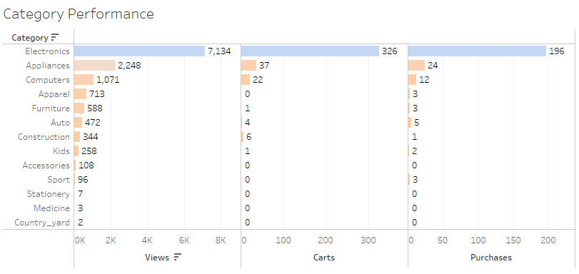
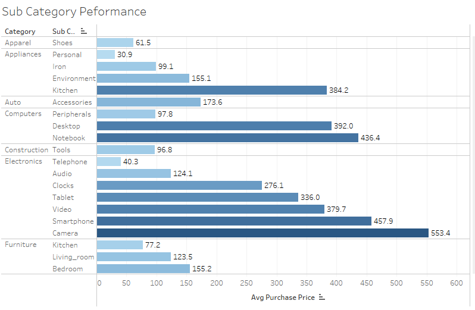
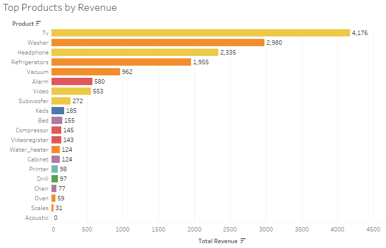
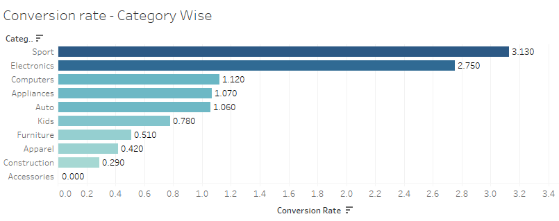

Now that we understand when people buy, we need to look at what they are buying. In a multi-category store, we can't treat all products the same—this analysis uncovers which specific departments are the heavy lifters driving our volume, and which ones are just taking up digital shelf space.

```sql
-- Category-level funnel and conversion
SELECT
    category AS Category,
    COUNT(DISTINCT CASE WHEN event_type = 'View'     THEN user_session END) AS Views,
    COUNT(DISTINCT CASE WHEN event_type = 'Cart'     THEN user_session END) AS Carts,
    COUNT(DISTINCT CASE WHEN event_type = 'Purchase' THEN user_session END) AS Purchases,
    ROUND(COUNT(DISTINCT CASE WHEN event_type = 'Purchase' THEN user_session END) * 100.0 /
          NULLIF(COUNT(DISTINCT CASE WHEN event_type = 'View' THEN user_session END), 0), 2)
          AS Conversion_Rate
FROM customer_data1
WHERE category IS NOT NULL
GROUP BY category;

-- Sub-category performance (purchases + avg purchase price)
SELECT
    category     AS Category,
    sub_category AS Sub_Category,
    COUNT(DISTINCT CASE WHEN event_type = 'Purchase' THEN user_session END) AS Purchases,
    ROUND(AVG(CASE WHEN event_type = 'Purchase' THEN price END), 2)         AS Avg_Purchase_Price
FROM customer_data1
WHERE category IS NOT NULL AND sub_category IS NOT NULL
GROUP BY category, sub_category
ORDER BY Purchases DESC;

-- Top products by revenue
SELECT
    product  AS Product,
    brand    AS Brand,
    category AS Category,
    COUNT(DISTINCT CASE WHEN event_type = 'Purchase' THEN user_session END) AS Total_Purchases,
    ROUND(SUM(CASE WHEN event_type = 'Purchase' THEN price ELSE 0 END), 2)  AS Total_Revenue
FROM customer_data1
WHERE product IS NOT NULL
GROUP BY product, brand, category
ORDER BY Total_Revenue DESC;
```

### Results

**Category performance:**

| Category | Views | Carts | Purchases | Conversion Rate |
|---|---|---|---|---|
| Electronics | 7,134 | 326 | 196 | **2.75%** |
| Appliances | 2,248 | 37 | 24 | 1.07% |
| Computers | 1,071 | 22 | 12 | 1.12% |
| Furniture | 588 | 1 | 3 | 0.51% |
| Apparel | 713 | 0 | 3 | 0.42% |
| Sport | 96 | 0 | 3 | **3.13%** (highest) |
| Auto | 472 | 4 | 5 | 1.06% |

**Highest average purchase prices by sub-category:**

| Sub-Category | Avg Purchase Price |
|---|---|
| Electronics → Camera | $553.40 |
| Electronics → Smartphone | $457.90 |
| Computers → Notebook | $436.40 |
| Appliances → Kitchen | $384.20 |
| Computers → Desktop | $392.00 |

**Top products by revenue:**

| Product | Revenue |
|---|---|
| TV | $4,176 |
| Washer | $2,980 |
| Headphone | $2,335 |
| Refrigerators | $1,955 |
| Vacuum | $962 |

> **Electronics dominates in both volume and revenue** — 7,134 views, 196 purchases, $79,274 total revenue. But Sport has the highest conversion rate (3.13%) despite minimal traffic (96 views), suggesting strong purchase intent among the few who visit. **Apparel and Furniture have near-zero cart rates despite meaningful traffic** — a clear signal that product presentation, pricing, or discoverability is failing in those categories.

---

## 5. Revenue Analysis

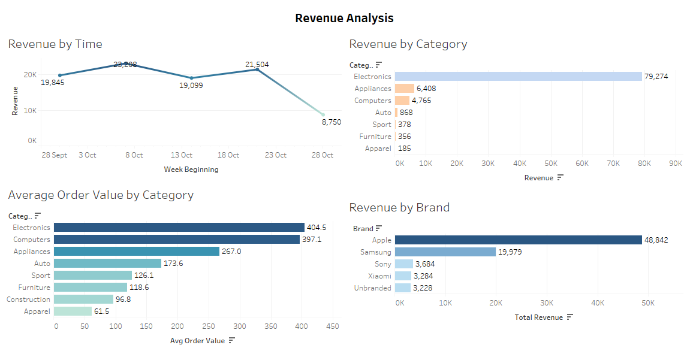

Knowing what sells is great, but we need to talk about the bottom line. This shifts the focus from raw item counts to actual financial health: where is the cash flow coming from, are our average order values stable, and are certain categories bringing in a disproportionate amount of our revenue?

```sql
-- Weekly revenue by category
SELECT
    week_beginning AS Week_Beginning,
    category       AS Category,
    ROUND(SUM(price), 2)              AS Revenue,
    COUNT(DISTINCT user_session)      AS Purchase_Sessions
FROM customer_data1
WHERE event_type = 'Purchase' AND category IS NOT NULL
GROUP BY week_beginning, category
ORDER BY week_beginning;

-- Average order value and revenue range by category
SELECT
    category AS Category,
    ROUND(AVG(price), 2) AS Avg_Order_Value,
    ROUND(MIN(price), 2) AS Min_Price,
    ROUND(MAX(price), 2) AS Max_Price,
    ROUND(SUM(price), 2) AS Total_Revenue
FROM customer_data1
WHERE event_type = 'Purchase' AND category IS NOT NULL
GROUP BY category
ORDER BY Total_Revenue DESC;

-- Revenue by brand
SELECT
    brand AS Brand,
    ROUND(SUM(price), 2)  AS Total_Revenue,
    COUNT(*)              AS Purchase_Count,
    ROUND(AVG(price), 2)  AS Avg_Price
FROM customer_data1
WHERE event_type = 'Purchase'
GROUP BY brand
ORDER BY Total_Revenue DESC;
```

### Results

**Weekly revenue trend:**

| Week | Revenue |
|---|---|
| 28 Sept | $19,845 |
| 3 Oct | $23,308 |
| 8 Oct | $19,099 |
| 13 Oct | $21,504 |
| 28 Oct | $8,750 (partial) |

**Revenue by category:**

| Category | Total Revenue | Avg Order Value |
|---|---|---|
| Electronics | **$79,274** | $404.50 |
| Appliances | $6,408 | $267.00 |
| Computers | $4,765 | $397.10 |
| Auto | $868 | $173.60 |
| Sport | $378 | $126.10 |
| Furniture | $356 | $118.60 |
| Apparel | $185 | $61.50 |

**Revenue by brand (top 5):**

| Brand | Total Revenue |
|---|---|
| Apple | **$48,842** |
| Samsung | $19,979 |
| Sony | $3,684 |
| Xiaomi | $3,284 |
| Unbranded | $3,228 |

> **Apple alone accounts for $48,842 — more than half of Electronics revenue.** Samsung is a distant second at $19,979. This extreme brand concentration is a business risk: if Apple products were out of stock or priced uncompetitively, revenue would collapse. Weekly revenue shows fluctuation between ~$19K–$23K without a consistent growth trend, suggesting no active acquisition or retention strategy was running in October.

---

## 6. Brand Analysis

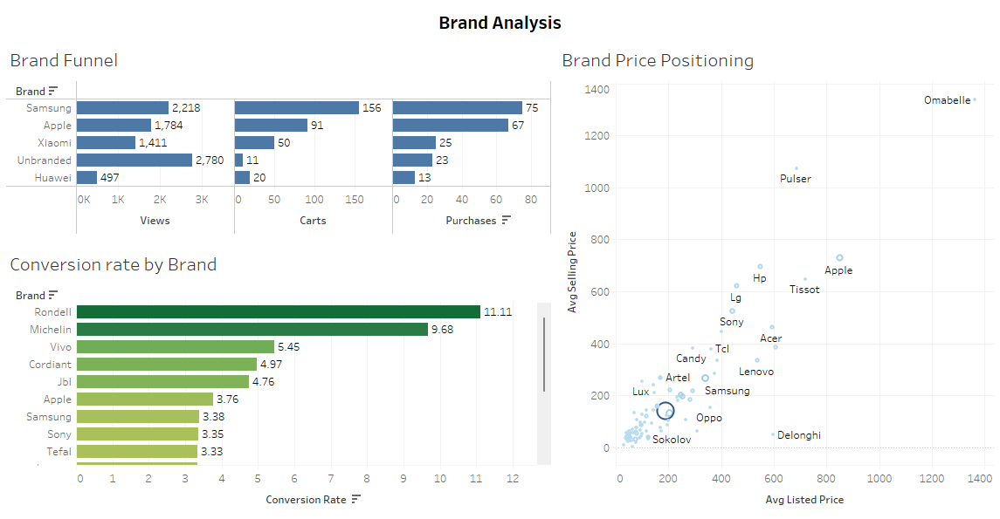

Since we are a multi-category marketplace, we don't just sell products—we sell brands. This analysis looks at the power of brand equity: do customers gravitate toward specific labels, and do certain brands have an easier time pulling users down the purchase funnel than others?

```sql
-- Brand funnel
SELECT
    brand AS Brand,
    COUNT(DISTINCT CASE WHEN event_type = 'View'     THEN user_session END) AS Views,
    COUNT(DISTINCT CASE WHEN event_type = 'Cart'     THEN user_session END) AS Carts,
    COUNT(DISTINCT CASE WHEN event_type = 'Purchase' THEN user_session END) AS Purchases,
    ROUND(COUNT(DISTINCT CASE WHEN event_type = 'Purchase' THEN user_session END) * 100.0 /
          NULLIF(COUNT(DISTINCT CASE WHEN event_type = 'View' THEN user_session END), 0), 2)
          AS Conversion_Rate
FROM customer_data1
GROUP BY brand
ORDER BY Purchases DESC;

-- Brand price positioning (listed vs actual selling price)
SELECT
    brand AS Brand,
    ROUND(AVG(CASE WHEN event_type = 'Purchase' THEN price END), 2) AS Avg_Selling_Price,
    ROUND(AVG(CASE WHEN event_type = 'View'     THEN price END), 2) AS Avg_Listed_Price,
    COUNT(DISTINCT product_id)                                       AS Product_Count
FROM customer_data1
GROUP BY brand
ORDER BY Avg_Selling_Price DESC;
```

### Results

**Top brands by purchase volume:**

| Brand | Views | Carts | Purchases | Conversion Rate |
|---|---|---|---|---|
| Samsung | 2,218 | 156 | 75 | 3.38% |
| Apple | 1,784 | 91 | 67 | 3.76% |
| Unbranded | 2,780 | 11 | 23 | 0.83% |
| Xiaomi | 1,411 | 50 | 25 | 1.77% |
| Huawei | 497 | 20 | 13 | 2.62% |

**Highest conversion rate brands (minimum threshold):**

| Brand | Conversion Rate |
|---|---|
| Rondell | **11.11%** |
| Michelin | 9.68% |
| Vivo | 5.45% |
| Cordiant | 4.97% |
| JBL | 4.76% |
| Apple | 3.76% |
| Samsung | 3.38% |

> **Unbranded products have 2,780 views but only a 0.83% conversion rate** — the worst among high-traffic options. These are products with no brand attribution, suggesting poor product data quality. Fixing brand metadata or curating these listings could convert a meaningful portion of that traffic. Meanwhile, niche brands like Rondell and Michelin show that targeted, high-intent audiences convert exceptionally well even with low traffic volumes.

---

## 7. User Behaviour Analysis

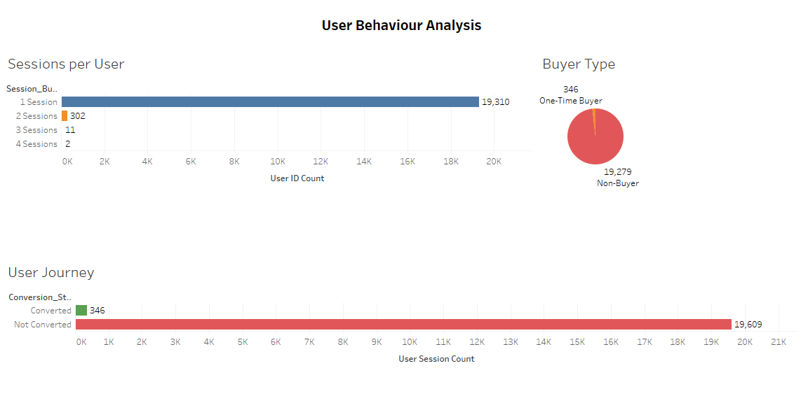

Up until this point, we've looked at products, revenue, and time. But what about the actual human beings clicking the buttons? This analysis dives into the shoppers themselves: are we surviving on a massive flood of one-time window shoppers, or do we have a loyal core of repeat buyers keeping the lights on?

```sql
-- Sessions per user
SELECT
    user_id AS User_ID,
    COUNT(DISTINCT user_session)                                              AS Total_Sessions,
    COUNT(DISTINCT CASE WHEN event_type = 'Purchase' THEN user_session END)  AS Purchase_Sessions,
    ROUND(SUM(CASE WHEN event_type = 'Purchase' THEN price ELSE 0 END), 2)   AS Total_Spent
FROM customer_data1
GROUP BY user_id
ORDER BY Total_Spent DESC;

-- Buyer type segmentation
WITH purchase_session AS (
    SELECT
        user_id AS User_ID,
        COUNT(DISTINCT CASE WHEN event_type = 'Purchase' THEN user_session END) AS Purchase_Sessions
    FROM customer_data1
    GROUP BY user_id
)
SELECT
    CASE
        WHEN purchase_sessions = 0 THEN 'Non-Buyer'
        WHEN purchase_sessions = 1 THEN 'One-Time Buyer'
        ELSE 'Repeat Buyer'
    END AS Buyer_Type,
    COUNT(DISTINCT user_id) AS User_Count
FROM purchase_session
GROUP BY Buyer_Type;

-- User journey (events per session)
SELECT
    user_session AS User_Session,
    COUNT(*) AS Total_Events,
    COUNT(DISTINCT event_type) AS Distinct_Stages,
    MAX(CASE WHEN event_type = 'Purchase' THEN 1 ELSE 0 END) AS Converted
FROM customer_data1
GROUP BY user_session
ORDER BY Total_Events DESC;
```

### Results

**Session distribution:**

| Sessions per User | User Count |
|---|---|
| 1 Session | **19,310** |
| 2 Sessions | 302 |
| 3 Sessions | 11 |
| 4 Sessions | 2 |

**Buyer type breakdown:**

| Buyer Type | User Count |
|---|---|
| Non-Buyer | **19,279** |
| One-Time Buyer | 346 |
| Repeat Buyer | 0 |

**User journey conversion:**

| Status | Session Count |
|---|---|
| Converted | 346 |
| Not Converted | **19,609** |

> **The platform has almost no repeat buyers in this dataset — 346 one-time buyers and zero repeat purchasers.** 98.2% of users are non-buyers. The overwhelming majority (19,310) only visit once and leave. This points to a significant retention and re-engagement gap. The business is spending resources on customer acquisition but has no visible mechanism to bring customers back. Even converting a small fraction of existing non-buyers into one-time buyers — without any new acquisition spend — would materially move the revenue needle.

---

## 8. Cart Abandonment Analysis

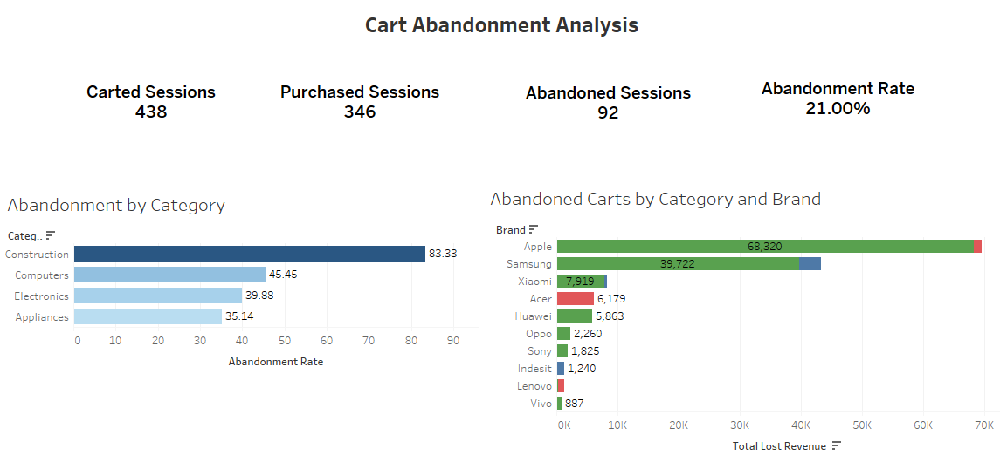

Looking at user behavior reveals a frustrating reality: a huge number of users add items to their cart but leave without paying. This is the closest a customer gets to giving us money before walking away—so we have to ask: exactly how much revenue are we leaving on the table right at the finish line, and why?

```sql
-- Overall abandonment summary
SELECT
    COUNT(DISTINCT CASE WHEN event_type = 'Cart'     THEN user_session END) AS Carted_Sessions,
    COUNT(DISTINCT CASE WHEN event_type = 'Purchase' THEN user_session END) AS Purchased_Sessions,
    COUNT(DISTINCT CASE WHEN event_type = 'Cart'     THEN user_session END) -
    COUNT(DISTINCT CASE WHEN event_type = 'Purchase' THEN user_session END) AS Abandoned_Sessions,
    ROUND((COUNT(DISTINCT CASE WHEN event_type = 'Cart' THEN user_session END) -
           COUNT(DISTINCT CASE WHEN event_type = 'Purchase' THEN user_session END)) * 100.0 /
           NULLIF(COUNT(DISTINCT CASE WHEN event_type = 'Cart' THEN user_session END), 0), 2)
           AS Abandonment_Rate
FROM customer_data1;

-- Abandonment rate by category
SELECT
    category AS Category,
    COUNT(DISTINCT CASE WHEN event_type = 'Cart'     THEN user_session END) AS Cart_Sessions,
    COUNT(DISTINCT CASE WHEN event_type = 'Purchase' THEN user_session END) AS Purchase_Sessions,
    ROUND((COUNT(DISTINCT CASE WHEN event_type = 'Cart' THEN user_session END) -
           COUNT(DISTINCT CASE WHEN event_type = 'Purchase' THEN user_session END)) * 100.0 /
           NULLIF(COUNT(DISTINCT CASE WHEN event_type = 'Cart' THEN user_session END), 0), 2)
           AS Abandonment_Rate
FROM customer_data1
WHERE category IS NOT NULL
GROUP BY category
ORDER BY Abandonment_Rate DESC;

-- Abandoned carts by category and brand (lost revenue quantified)
SELECT
    category AS Category,
    brand    AS Brand,
    COUNT(DISTINCT user_session)              AS Abandoned_Sessions,
    ROUND(MAX(price), 2)                      AS Highest_Cart_Price,
    ROUND(AVG(price), 2)                      AS Avg_Cart_Price,
    ROUND(SUM(price), 2)                      AS Total_Lost_Revenue
FROM customer_data1
WHERE event_type = 'Cart'
  AND user_session NOT IN (
      SELECT DISTINCT user_session FROM customer_data1 WHERE event_type = 'Purchase'
  )
  AND category IS NOT NULL AND brand IS NOT NULL
GROUP BY category, brand
ORDER BY Total_Lost_Revenue DESC;
```

### Results

**Overall cart abandonment:**

| Metric | Value |
|---|---|
| Carted Sessions | 438 |
| Purchased Sessions | 346 |
| Abandoned Sessions | **92** |
| Abandonment Rate | **21%** |

**Abandonment rate by category:**

| Category | Abandonment Rate |
|---|---|
| Construction | **83.33%** |
| Computers | 45.45% |
| Electronics | 39.88% |
| Appliances | 35.14% |

**Lost revenue by brand (abandoned carts):**

| Brand | Total Lost Revenue |
|---|---|
| Apple | **$68,320** |
| Samsung | $39,722 |
| Xiaomi | $7,919 |
| Acer | $6,179 |
| Huawei | $5,863 |

> **Apple's abandoned carts represent $68,320 in lost revenue — the single largest recoverable opportunity in this dataset.** Samsung adds another $39,722. Together, these two brands account for the majority of cart abandonment loss. Given that both brands have strong conversion rates when they do convert, this is likely a friction issue (checkout hesitation, price comparison) rather than a product quality issue. A targeted cart recovery email sequence for Apple and Samsung carts could capture a significant portion of this revenue.

---

## 9. Product-Level Analysis

Finally, we zoom all the way into the micro-level. Macro trends and brand power are ultimately built on individual items. This final analysis pinpoints our specific "hero products" that single-handedly attract traffic, as well as the underperforming individual SKUs that might be hurting our overall margins.

```sql
-- View-to-purchase ratio per product
SELECT
    product_id AS Product_Id,
    product    AS Product,
    brand      AS Brand,
    category   AS Category,
    COUNT(DISTINCT CASE WHEN event_type = 'View'     THEN user_session END) AS Views,
    COUNT(DISTINCT CASE WHEN event_type = 'Purchase' THEN user_session END) AS Purchases,
    ROUND(COUNT(DISTINCT CASE WHEN event_type = 'Purchase' THEN user_session END) * 100.0 /
          NULLIF(COUNT(DISTINCT CASE WHEN event_type = 'View' THEN user_session END), 0), 2)
          AS Conversion_Rate
FROM customer_data1
GROUP BY product_id, product, brand, category
ORDER BY Views DESC;

-- Price bucket conversion rates
SELECT
    CASE
        WHEN price < 50            THEN 'Under $50'
        WHEN price BETWEEN 50  AND 200 THEN '$50–$200'
        WHEN price BETWEEN 200 AND 500 THEN '$200–$500'
        ELSE 'Above $500'
    END AS Price_Bucket,
    COUNT(DISTINCT CASE WHEN event_type = 'View'     THEN user_session END) AS Views,
    COUNT(DISTINCT CASE WHEN event_type = 'Purchase' THEN user_session END) AS Purchases,
    ROUND(COUNT(DISTINCT CASE WHEN event_type = 'Purchase' THEN user_session END) * 100.0 /
          NULLIF(COUNT(DISTINCT CASE WHEN event_type = 'View' THEN user_session END), 0), 2)
          AS Conversion_Rate
FROM customer_data1
GROUP BY Price_Bucket
ORDER BY Conversion_Rate DESC;
```

### Results

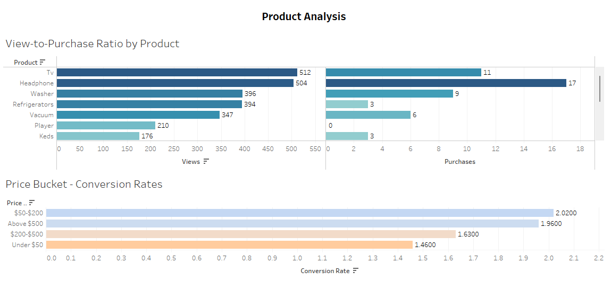

**Most-viewed products vs purchases:**

| Product | Views | Purchases |
|---|---|---|
| TV | 512 | 11 |
| Headphone | 504 | 17 |
| Washer | 396 | 9 |
| Refrigerators | 394 | 3 |
| Vacuum | 347 | 6 |

**Conversion rate by price bucket:**

| Price Range | Conversion Rate |
|---|---|
| $50–$200 | **2.02%** (highest) |
| Above $500 | 1.96% |
| $200–$500 | 1.63% |
| Under $50 | 1.46% (lowest) |

> **Headphones have the best purchase-to-view ratio among high-traffic products (17 purchases from 504 views).** TVs, despite being the highest-revenue product overall, convert at a lower rate — likely due to higher prices prompting more deliberate decision-making. The price bucket analysis reveals a counterintuitive finding: **products above $500 convert at nearly the same rate as the $50–$200 range**, suggesting high-value customers are not particularly price-sensitive. The weakest conversion is in the under-$50 range, where the assortment may lack compelling or well-presented products.

---

## 10. Python Automation

SQL query results were programmatically extracted and exported to CSV files using Python(Pandas), which were then utilized as the primary data source to build and refresh the interactive Tableau visualizations. 
**[SQL to CSV Automation Script](Python/SQLProjectCSVAutomation-checkpoint.ipynb)

---

## 11. Key Findings & Recommendations

### Summary of Findings

| # | Finding | Data Point |
|---|---|---|
| 1 | The conversion crisis is at Browse → Cart, not Cart → Checkout | 97.7% of sessions never add to cart; 79% of cart sessions do purchase |
| 2 | Electronics drives virtually all revenue | $79,274 of total revenue; 2.75% conversion rate |
| 3 | Apple abandoned carts = the single biggest revenue leak | $68,320 in lost revenue from abandoned Apple carts alone |
| 4 | The platform has zero repeat buyers in October | 346 one-time buyers; 0 repeat buyers |
| 5 | Unbranded products waste traffic | 2,780 views, 0.83% conversion — worst rate of any high-traffic segment |
| 6 | Sport has the highest conversion rate but almost no traffic | 3.13% conversion on 96 views |
| 7 | Tuesday is the highest engagement day | 3,207 total events — 30% more than Monday |
| 8 | Construction category has 83% cart abandonment | Highest abandonment of any category |
| 9 | $50–$200 price range converts best | 2.02% — marginally better than premium ($500+) at 1.96% |
| 10 | Apple accounts for more than half of all Electronics revenue | $48,842 out of $79,274 |

---

### Recommendations

**1. Fix the Browse-to-Cart Drop-off (Priority 1)**
97.7% of browsers never add to cart. This is not a checkout problem — it is a product discovery and engagement problem. The business should test improvements to product pages, introduce recommendation engines ("customers also viewed"), and surface social proof such as ratings and reviews. A/B testing product page layouts for the top 10 most-viewed products (TV, Headphone, Washer) would produce the fastest measurable impact.

**2. Launch a Cart Recovery Campaign for Apple and Samsung**
$68,320 and $39,722 in Apple and Samsung abandoned cart value respectively are recoverable through a simple email or push notification sequence. A 20% recovery rate on these two brands alone would generate ~$21,000 in revenue — with no new customer acquisition cost. Given that both brands already have strong conversion rates when they do convert, the barrier is likely friction or price-comparison hesitation, not product dissatisfaction.

**3. Build a Repeat Purchase Strategy**
Zero repeat buyers in a full month signals the absence of any retention mechanism. The business should implement a post-purchase email sequence, a loyalty programme, or personalised recommendations based on purchase history. Even moving 5% of one-time buyers to a second purchase would compound revenue significantly.

**4. Invest in Tuesday Campaigns**
Traffic is consistently highest on Tuesdays (3,207 events) and lowest on Mondays (2,470). Promotional emails, new product launches, and paid media should be scheduled for Tuesday to reach the highest-intent audience at peak engagement.

**5. Audit and Fix Unbranded Product Listings**
2,780 sessions viewed unbranded products but only 0.83% converted — the worst ratio of any meaningful traffic segment. Many of these may be real branded products with missing metadata. Enriching brand data for these SKUs and improving listing quality could unlock conversions from an audience already on the site.

**6. Grow the Sport Category**
Sport has a 3.13% conversion rate — the highest of any category — but only 96 views. This audience converts when they find what they're looking for. Expanding the Sport assortment and improving its discoverability (search, navigation, homepage placement) could generate disproportionate revenue from a small investment.

---

## Repository Structure

```
ecommerce-sql-analysis/
├── sql/
│   ├── 01_data_cleaning.sql
│   ├── 02_funnel_analysis.sql
│   ├── 03_trend_analysis.sql
│   ├── 04_category_performance.sql
│   ├── 05_revenue_analysis.sql
│   ├── 06_brand_analysis.sql
│   ├── 07_user_behaviour.sql
│   ├── 08_cart_abandonment.sql
│   └── 09_product_analysis.sql
│   └── 10_python_automation.ipynb
├── Python/              # CSV generated by Python for Tableau
├── screenshot/          # Dashboard images
└── README.md
```

---

## About

This project is part of my data analytics portfolio, demonstrating end-to-end competency across data cleaning, SQL analysis, business problem framing, and dashboard storytelling.

**Portfolio:** [your-portfolio-link]  
**LinkedIn:** [your-linkedin]  
**Tableau Public:** [your-tableau-link]

---

*Built with SQLite · DBeaver · Python · Tableau · October 2019 e-commerce data*
